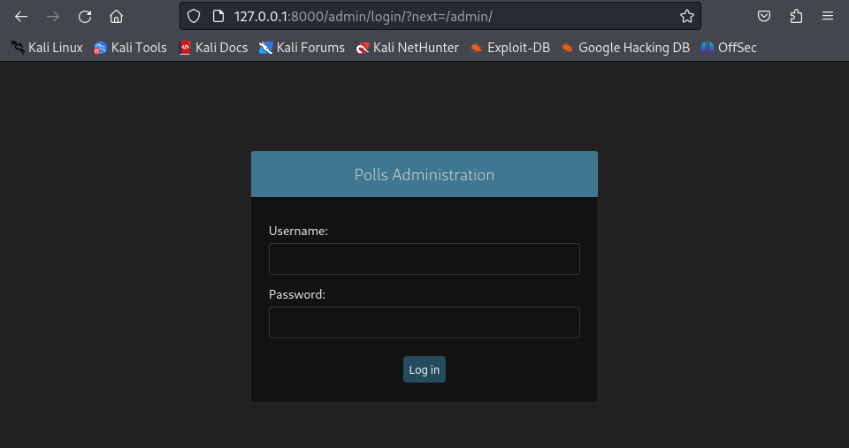
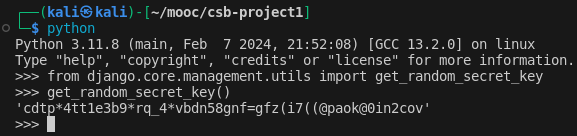

# Cyber Security Base - Project 1 - Report

Installation:
Python 3.11.8 and Django 4.2.10 used as in the Django tutorial [here](https://docs.djangoproject.com/en/4.2/intro/tutorial01/).

Additional Python package [python-dotenv](https://pypi.org/project/python-dotenv/) used.
Installing: pip install python-dotenv

### FLAW 1: A07:2021 – Identification and Authentication Failures

A [switch](https://github.com/eznisula/flawedWebApp/blob/9fd1eb97cfcca1f2bf38ed0ae45057dbe798c1c7/flawedWebApp/flawedWebApp/settings.py#L23) that can be used to demonstrate the flaw.
The [location](https://github.com/eznisula/flawedWebApp/blob/9fd1eb97cfcca1f2bf38ed0ae45057dbe798c1c7/flawedWebApp/flawedWebApp/csrf.py#L355) where the switch is used to omit CSRF token check, demonstrating the flaw.

The first flaw relates to permitting brute-force attack towards admin login panel, which could be mitigated in multiple ways. Here, I have disabled the Cross Site Request Forgery (CSRF) token check which, along with missing rate limiting mechanism, results in a flaw where admin panel credentials can be obtained with a brute-force attack. This is rather easy because Django doesn’t force a strong admin password, being satisfied with anything after notifying the admin. Now just weak Django admin credentials won’t do it when the attacker is going to do an automated dictionary attack, as by default Django forces a CSRF token check for POST requests, which is the case with the admin login panel. Simply ignoring this check for any given reason, e.g. software development/testing, and leaving it in place, makes the web application easily exploitable using automated methods.

I disabled the CSRF check to exploit the flaw. Using a simple network login cracker Hydra, I tried to perform a dictionary attack against the admin login (Fig. 1) so that both username and password are to be guessed.

_Figure 1. Web application admin login._

With CSRF token check enabled, Hydra fails to attack the web application without a suitable token. Figure 2 below illustrates the failure.

_Figure 2. On top the output of Django web application server and below the failed brute-force attempt using Hydra. The two input lists (usernames.txt and passwords.txt) are shortened versions of Metasploit’s "common roots.txt" -wordlist [1] containing the correct credentials as well as 70 wrong ones just for sake of example._

Disabling the CSRF token check, I am able to extract the correct credentials using the same approach as shown in figure 3.

_Figure 3. Successful attack without the CSRF token check enabled gives the admin credentials._

To fix the flaw in this case, one needs to set

`SKIP_CSRF_CHECK = True`

in flawedWebApp/settings.py. This makes Django require the CSRF token on every POST request, which is the default when using django.middleware.csrf.CsrfViewMiddleware that is included in Django template project created by django-admin. [2] To make the web application more secure, one would obviously set admin credentials so that the attacker wouldn’t succeed in brute-forcing them. Also including rate-limiting mechanism to the login panel, one could make automated attacks like this more unsuccessful.

### FLAW 2: A05:2021 – Security Misconfiguration

A [switch](https://github.com/eznisula/flawedWebApp/blob/9fd1eb97cfcca1f2bf38ed0ae45057dbe798c1c7/flawedWebApp/flawedWebApp/settings.py#L26) to demonstrate the flaw.
The [location](https://github.com/eznisula/flawedWebApp/blob/9fd1eb97cfcca1f2bf38ed0ae45057dbe798c1c7/flawedWebApp/flawedWebApp/settings.py#L33) where the switch is used to fix exposed secret key.

Second flaw is a security misconfiguration vulnerability. The web application’s SECRET_KEY is exposed as it is written by default in cleartext in flawedWebApp/flawedWebApp/settings.py. A secret key is different between Django instances. The key is used both in cryptographic signing and password hashing and thus should be set to a unique value. [7] Signing can be used to e.g. setting and reading signed cookies containing sensitive data as well as keeping users’ sessions private. In this case, the secret key

`SECRET_KEY='django-insecure-3&obu5t5d%i)we=qf_(rjt*&ntpdb5e2#^#wpux3poys#b5y3h'`

was randomly generated when the Django project was started. As the key is available there in public version control system, an attacker could break the web application leading to privilege escalation and remote code execution. [7]

Fixing the vulnerability requires a fresh secret key and storing it so that it is not publicly available. I generated a new secret key using Python shell (Figure 4).

_Figure 4. Creating a new secret key._

The output was a new key which I added as a key-value pair in a new file  flawedWebApp/.env, which should be not published on version control (but it is included in version control here for example). The new private secret key is read from this file in settings.py and so the key remains only on the server.

### FLAW 3: A10:2021 – Server-Side Request Forgery (SSRF)

A [switch](https://github.com/eznisula/flawedWebApp/blob/3224edcdb127d61ad8d672f1d13ab58799dbe8ef/flawedWebApp/flawedWebApp/settings.py#L128) that can be used to demonstrate the flaw.
The [location](https://github.com/eznisula/flawedWebApp/blob/3224edcdb127d61ad8d672f1d13ab58799dbe8ef/flawedWebApp/polls/views.py#L53) where the aforementioned switch is used to fix a voting race condition.

Third flaw is a race condition in the web application’s voting mechanism, which happens due to an improper database transaction when multiple transactions are done at the same time. Basically when a vote is cast, the value for the given option is incremented by 1 in the database (SQLite) and the current result is shown to the user on the results-page. Now to be more precise, the application first reads the option’s current value from the database and then computes the new value for it, after which it saves the new value. Let’s assume option 1 has 15 votes and two users are voting that at the same time. The current value (15) is retrieved for both users and if race condition takes place, new value will be computed for both of them (16), which is then saved. The results-page show 16 votes for the option, whereas expected vote would be 17. The first vote will be overwritten.

To demonstrate the flaw, one needs to send multiple vote requests simultaneously. This can be done e.g. using BurpSuite’s Repeater functionality. Suppose votes are cast as depicted in figure 5 below.

_Figure 5. Votes before sending requests using BurpSuite._

I captured the voting request using BurpSuite Target and send just one request to see voting working (Figure 6).

_Figure 6. BurpSuite Repeater tab containing the voting request. Note the orange “Send” button on top-left corner indicating only one request being sent._

After sending the request, everything goes as expected, as shown in figure 7 below.

_Figure 7. Votes after one request sent._

Next, to see the race condition flaw in action, a group of 10 similar requests were sent parallel (Figure 8).

_Figure 8. Sending 10 voting requests in parallel. Note the orange “Send group (parallel)” button on the top-left corner again._

Now the results should display all 10 additional votes, but only one is shown (Figure 9).

_Figure 9. Ten simultaneous requests result in only one being registered. Running the test multiple times, sometimes two votes got in._

Applying the fix for the flaw, the same parallel request results in all 10 getting registered (Figure 10).

_Figure 10. Fixing the race condition results in votes being registered correctly. Note that here there are 11 votes more than in figure 8. This is because I had to apply the fix, restart the server, and record the voting request again, which added one vote more._

Fixing the race condition flaw is simple, as Django provides functionality dealing with it. The fix uses a class called

`F()`

which makes it possible to refer to a model field values (here, the voting option’s value) and perform database operations using them without pulling them out of the database into Python memory. [3] So the class makes the database do the work instead of Python. This avoids race conditions because the database only updates a field based on the value of the field in the database when it is saved, rather than based on the value that is retrieved before saving.

### FLAW 4: A03:2021 - Injection

A [switch](https://github.com/eznisula/flawedWebApp/blob/9fd1eb97cfcca1f2bf38ed0ae45057dbe798c1c7/flawedWebApp/flawedWebApp/settings.py#L25) to demonstrate the flaw.
The [location](https://github.com/eznisula/flawedWebApp/blob/9fd1eb97cfcca1f2bf38ed0ae45057dbe798c1c7/flawedWebApp/polls/views.py#L47) where the switch is used to fix an SQL injection.

Fourth flaw is an SQL injection vulnerability. In the voting functionality, there is now a “other” option for those who aren’t satisfied with the options given by the administrator. Figure 11 below illustrates the options.

_Figure 11. User may add another option to vote by filling the “Other” field and pressing vote._

The attacker wants to break everything that is of value and thus targets the already cast votes. Now let’s assume a situation, where there are already votes recorded in the database (Figure 12).

_Figure 12. Votes already recorded in the database._

The SQL injection string can be inserted into the “Other” field and that will be executed by the database engine. The web application dangerously constructs raw SQL queries and uses them as they are without sanitizing. The string to input is the following:

`vuln', 0, 2); UPDATE polls_choice SET votes=0 WHERE 0=0; --`

Constructing such a string requires some Django knowledge and deduction. Going though debug traces which Django spits out when providing erroneous inputs in this field (by default Django has debug traces enabled for development environment), one can assume that there are “polls” and “choices” which in turn relate to “votes”. Knowing that Django automatically generates table names by combining name of the app (polls) and the model (choice) [4], one still needs to figure out the structure of the intended SQL command which includes the option text (vuln), option votes (0), and question number (2, shown in URL as well). These can be hard to figure out, but not impossible for sure. Lastly, the attacker gives “votes” new value “0”. Submitting this SQL injection string results in zeroed votes (Figure 13).

_Figure 13. Registered votes are zeroed due to SQL injection attack._

Vulnerability mitigation is done by using Django’s inbuilt mechanism for creating a new items in a database. Using “Querysets”, one is protected from SQL injection as the queries are constructed using query parametrization, instead of plain raw SQL. Django’s SQL injection protection defines SQL code separately from query’s parameters and escapes user-provided and unsafe parameters. [5] This is easy for the programmer, as the database driver does all the work after a single line of code.

### FLAW 5: Cross Site Request Forgery (CSRF)

The [location](https://github.com/eznisula/flawedWebApp/blob/9fd1eb97cfcca1f2bf38ed0ae45057dbe798c1c7/flawedWebApp/polls/views.py#L41) of a function decorator forcing CSRF exempt on the voting view.

Fifth flaw is a CSRF vulnerability. Here, the voting mechanism of the web application is abused so that an attacker is able to craft a link which upon clicking, adds a vote to an option of the attacker’s choice. This link could be sent to a victim via email or it could be a button on a malicious website. Now, for the sake of example, I have added such a button on the results-page (Figure 14).

_Figure 14. Clicking the “Regular button” sends a POST request that increments votes for option “Not much”._

The POST request was recorded using BurpSuite and the data was hid behind the button in results.html.

Fix for CSRF attack can be done by removing a Python function decorator

`@csrf_exempt`

from the function handling the voting mechanism. This decorator marks a view as being exempt from the protection provided by the CSRF middleware included by default in Django. [6] This feature could be used in testing/development phase of the web application and could be then accidentally left there. Django also provides “csrf_token” -tags that are to be used in POST-forms. These tags make Django generate a token on the server-side while rendering the page and does a  cross-check for this token on incoming requests.

References:
[1]: https://github.com/rapid7/metasploit-framework/blob/master/data/wordlists/common_roots.txt
[2]: https://docs.djangoproject.com/en/4.2/intro/tutorial01/#creating-a-project
[3]: https://docs.djangoproject.com/en/4.2/ref/models/expressions/#f-expressions
[4]: https://docs.djangoproject.com/en/4.2/intro/tutorial02/#activating-models
[5]: https://docs.djangoproject.com/en/4.2/topics/security/#sql-injection-protection
[6]: https://docs.djangoproject.com/en/4.2/ref/csrf/#django.views.decorators.csrf.csrf_exempt
[7]: https://docs.djangoproject.com/en/4.2/ref/settings/#secret-key
